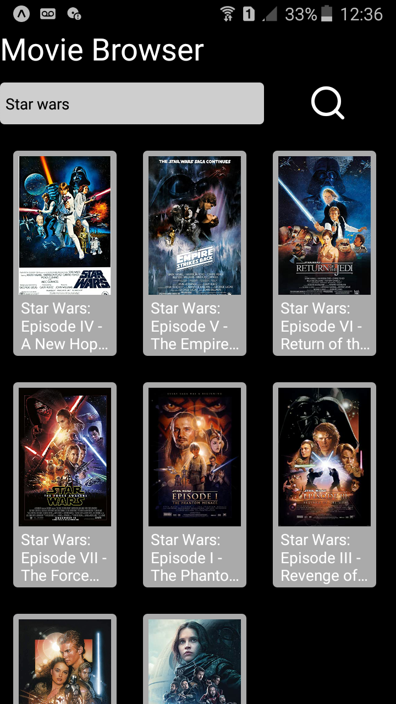
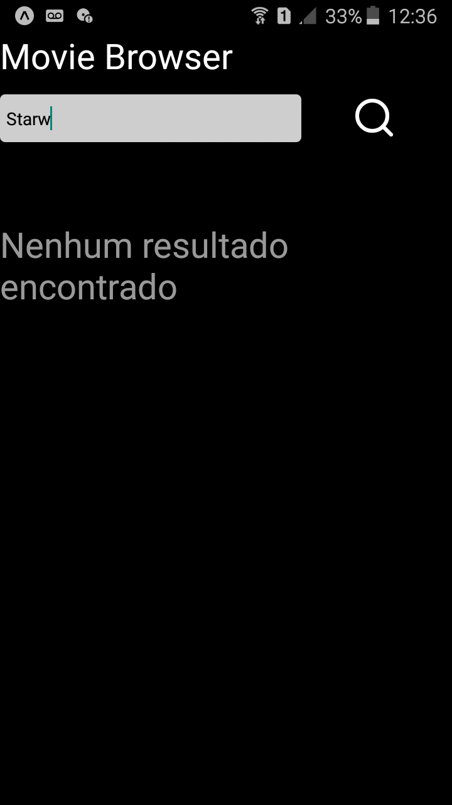
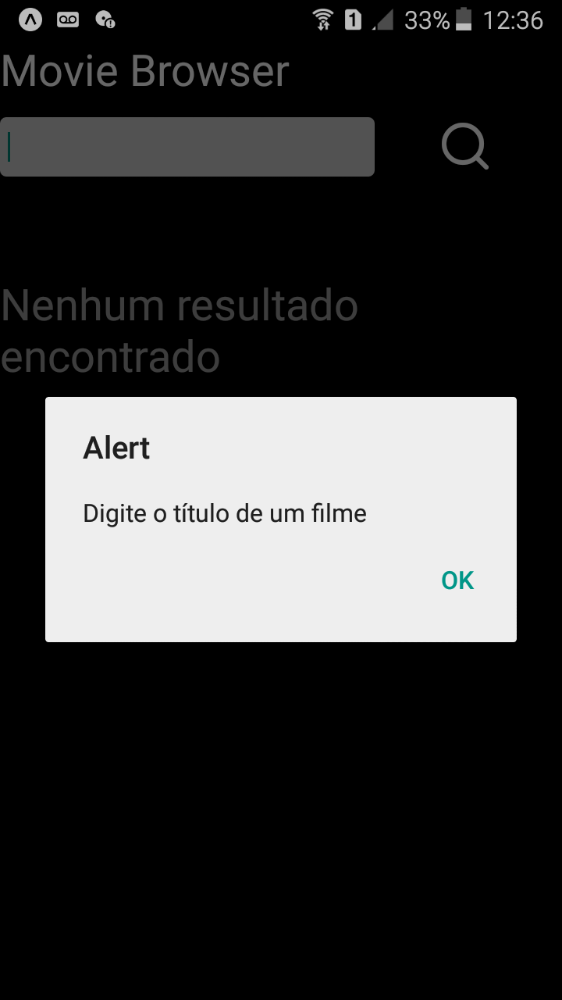
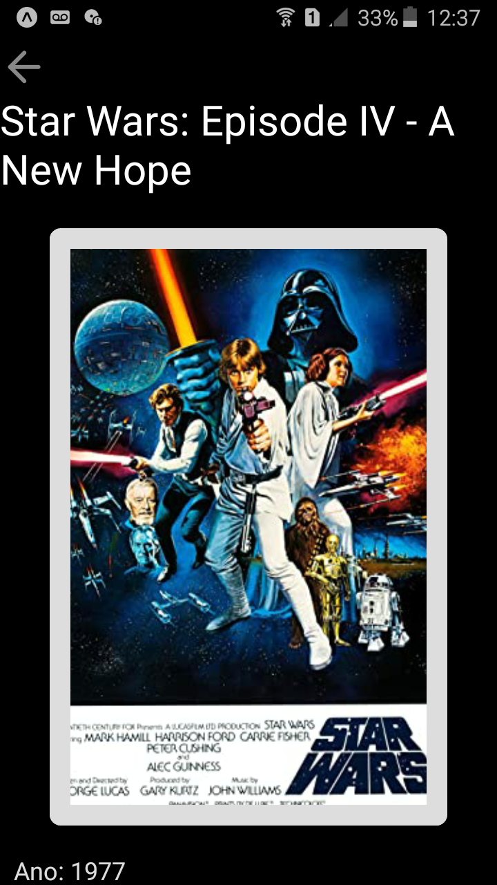
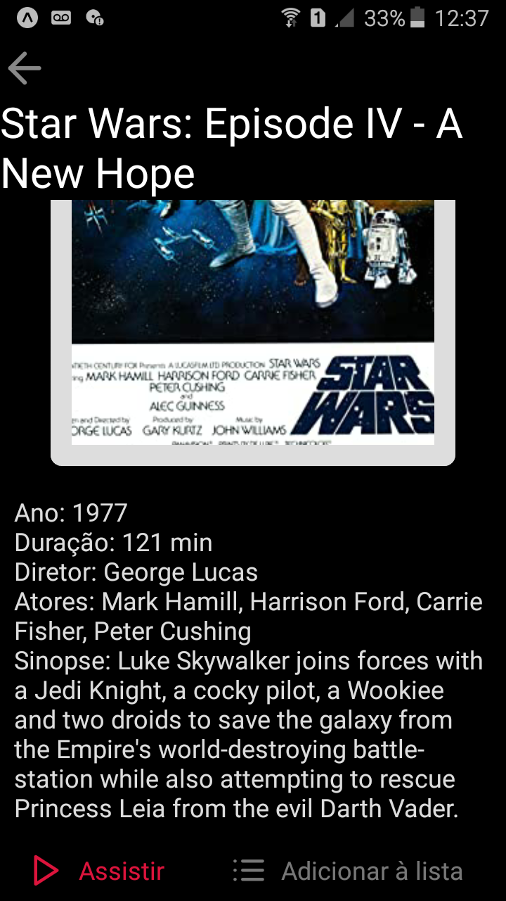

# Movie Browser
 Aplicativo que simula site de busca de vídeos feito como projeto para treinar React Native.

 

  
  
  

  
  

## Requisitos
    Instalar o Git
    https://git-scm.com/downloads

    Instalar o NodeJs
    https://nodejs.org/en/

    Installar o Expo CLI
    https://docs.expo.io/get-started/installation/

## Primeiro passo - baixar o projeto
Faça download do repositório acima ou use o seguinte comando na pasta onde deseja baixar o projeto:
 - git clone https://github.com/AloisioFernandes/

## Terceiro passo - instalar dependências
Digite o seguinte comando dentro da pasta project2 através do terminal:
 - npm install

## Sexto passo - iniciar app
Dentro da pasta project2, digite o seguinte comando no terminal: 
 - expo start

Ao executar esse comando, uma página abrirá no seu navegador web. Utilize o aplicativo do expo para abrir o app através do QRCode da página.